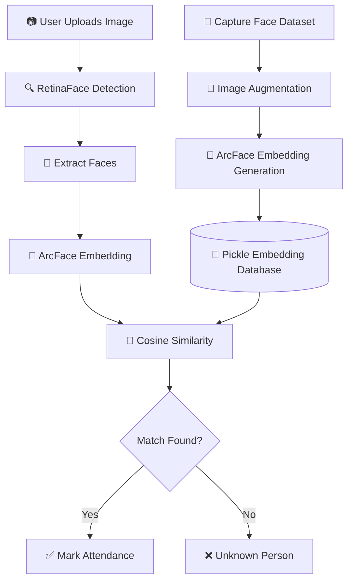

<div align="center">

# ⚡ IdentityX
### AI-Powered Face Recognition Attendance System


<br>


</div>

---

# 🎬 Project Showcase

IdentityX is an AI-driven attendance system that recognizes individuals using deep facial embeddings rather than traditional image comparison techniques.

Instead of storing raw images and performing naive pixel matching, IdentityX converts every face into a unique mathematical representation known as an **embedding vector**.

This allows:

✅ Fast Recognition

✅ High Accuracy

✅ Scalability

✅ Robustness to Lighting Variations

✅ Robustness to Pose Changes

---

# ✨ Core Idea

Most attendance systems compare images.

IdentityX compares identities.

Every face is transformed into a high-dimensional embedding generated by ArcFace.

When a new image is uploaded:

1. Faces are detected
2. Embeddings are generated
3. Similarity is calculated
4. Identity is determined

The result is an attendance system powered by modern facial recognition techniques used in real-world biometric systems.

---

# 🏗️ System Architecture



---

# 🧠 AI Pipeline

## Step 1 — Dataset Creation

IdentityX starts by collecting images of an individual.

The collected images become the foundation of the recognition database.

---

## Step 2 — Data Augmentation

To improve robustness, images are augmented.

Examples include:

- Rotation
- Flipping
- Brightness Adjustment
- Zoom Variations

This teaches the model to recognize faces under different real-world conditions.

---

## Step 3 — Embedding Generation

ArcFace converts every face into a numerical embedding.

```text
Face Image
      ↓
ArcFace
      ↓
512-Dimensional Vector
```

These vectors become the person's digital identity.

---

## Step 4 — Embedding Database

Instead of storing thousands of images:

```python
{
   "Ritvik": [0.12, 0.55, ...],
   "Trisha": [0.34, 0.91, ...],
   "Ivy": [0.67, 0.22, ...]
}
```

IdentityX stores compact embedding representations inside a Pickle database.

Benefits:

- Faster lookup
- Lower storage usage
- Better scalability

---

# 🔍 Recognition Pipeline

When a user uploads an image:

### 1. Face Detection

RetinaFace locates every face present in the image.

```text
Input Image
     ↓
RetinaFace
     ↓
Detected Face Regions
```

---

### 2. Face Encoding

Each detected face is passed to ArcFace.

```text
Detected Face
      ↓
ArcFace
      ↓
Embedding Vector
```

---

### 3. Similarity Search

IdentityX compares embeddings using:

```math
Cosine Similarity
```

Higher similarity score = higher probability of identity match.

---

### 4. Attendance Decision

```text
Similarity > Threshold
        ↓
Recognized
        ↓
Attendance Marked
```

Otherwise:

```text
Unknown Person
```

---

# ⚡ Why ArcFace?

ArcFace is one of the most widely used face recognition architectures.

Advantages:

- State-of-the-art recognition accuracy
- Robust embedding generation
- Works well across pose variations
- Excellent real-world performance

---

# 🔥 Why RetinaFace?

RetinaFace provides:

- Accurate face localization
- Landmark detection
- Better detection of difficult faces
- High performance under challenging conditions

---

# 📊 Technology Stack

| Component | Technology |
|------------|------------|
| Backend | FastAPI |
| AI Framework | InsightFace |
| Face Detector | RetinaFace |
| Face Recognizer | ArcFace |
| Similarity Metric | Cosine Similarity |
| Image Processing | OpenCV |
| Numerical Computing | NumPy |
| Storage | Pickle |

---

# 🚀 Features

### Intelligent Face Recognition

Embedding-based identity matching.

### Multi-Person Detection

Recognizes multiple people within a single image.

### FastAPI Backend

High-performance API architecture.

### Lightweight Storage

Embedding database stored using Pickle.

### Real-Time Recognition Ready

Can be extended to webcam and surveillance streams.

---


# 🎯 Recognition Flow

```text
Collect Images
      ↓
Augment Dataset
      ↓
Generate ArcFace Embeddings
      ↓
Store Embeddings
      ↓
Upload Group Image
      ↓
RetinaFace Detection
      ↓
ArcFace Encoding
      ↓
Cosine Similarity
      ↓
Recognized Identity
      ↓
Attendance Marked
```

---

# 🌟 Future Enhancements

- Real-Time Webcam Attendance
- Attendance Dashboard
- MongoDB Integration
- Vector Database Search
- Face Anti-Spoofing
- Liveness Detection
- Attendance Analytics
- Cloud Deployment

---

# 👨‍💻 Author

### Ritvik Arora

AI Engineer • Computer Vision Enthusiast • Backend Developer

Building intelligent systems where mathematics meets reality.

---

<div align="center">

### ⭐ If you like this project, give it a star.


</div>
